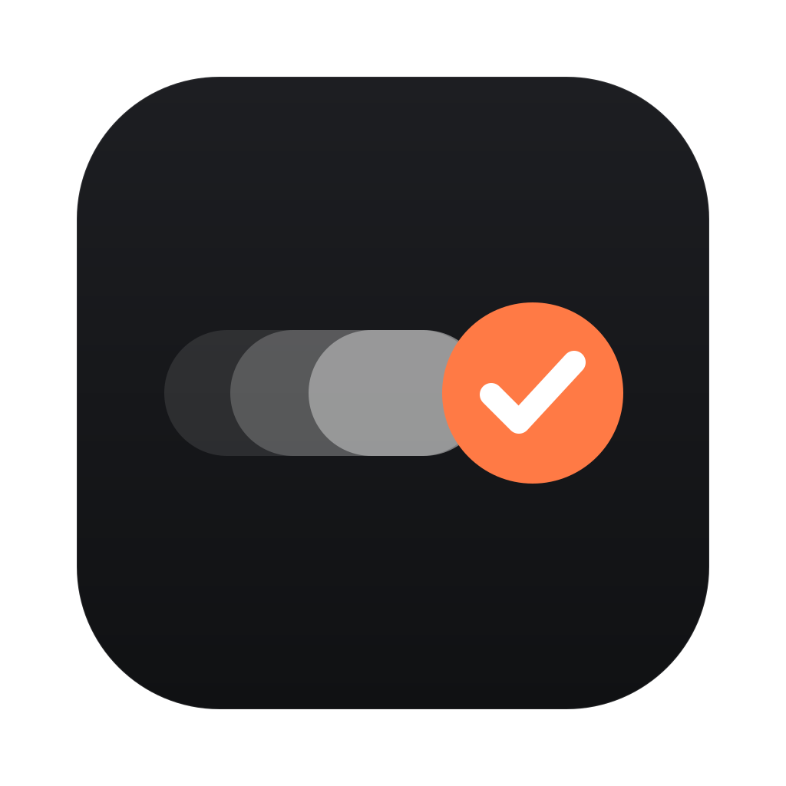
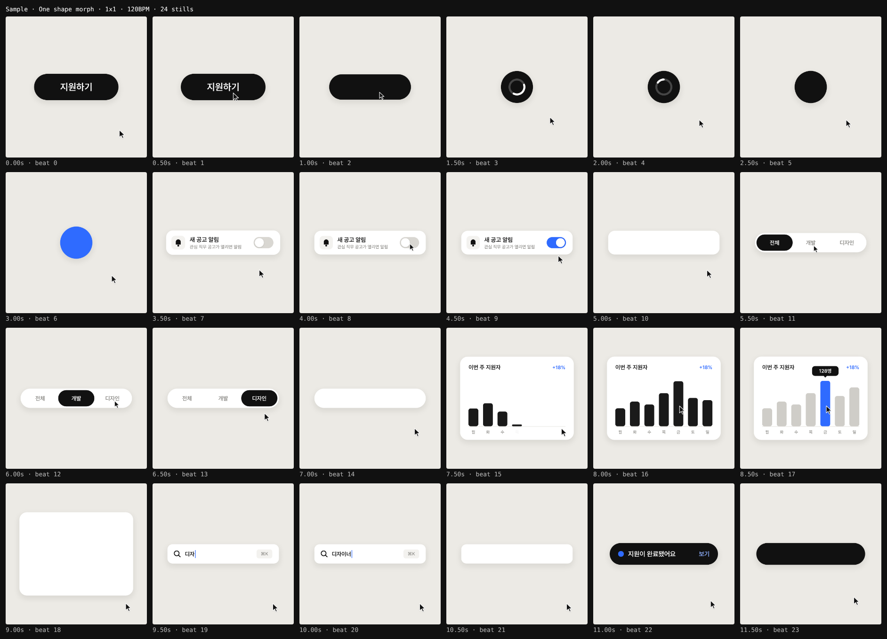

<p align="center">
  
</p>

<h1 align="center">
  <picture>
    <source media="(prefers-color-scheme: dark)" srcset="assets/brand/wordmark-dark.svg">
    
  </picture>
</h1>

<p align="center">
  <b>말로 만드는 모션 영상</b><br>
  만들고 싶은 영상을 말하면 AI 에이전트가 장면을 짜고, 렌더하고, 자기 프레임을 직접 보고 고칩니다.<br>
  After Effects도, 코드도, 터미널도 필요 없습니다.
</p>

<p align="center">
  <a href="https://github.com/kimtaeho-dev/motion-studio/releases/latest"><b>↓ 앱 다운로드 (macOS)</b></a>
  &nbsp;·&nbsp;
  <a href="#사용-가이드">사용 가이드</a>
  &nbsp;·&nbsp;
  <a href="#개발자용">개발자용</a>
</p>

<p align="center">
  
</p>

---

## 이렇게 만듭니다

| | 하는 일 |
| --- | --- |
| **1. 말합니다** | 새 필름을 만들고 채팅창에 원하는 영상을 설명합니다. 레퍼런스 이미지·영상이나 3D 모델(.glb)은 끌어다 놓으면 됩니다 |
| **2. 확인합니다** | 에이전트가 브리프와 비트별 장면 목록(숏리스트)을 보여주고 멈춥니다. **승인**을 누르면 만들기 시작합니다 |
| **3. 받습니다** | 렌더하고, 점수를 매겨 고치고, 완성본을 보여줍니다. **내보내기**로 MP4·GIF·ProRes·WebM을 받습니다 |

중간에 문구·색·장면 타이밍은 직접 고칠 수도 있고, 말로 고쳐 달라고 할 수도 있습니다.

---

## 사용 가이드

- [A. 앱 받아서 열기](#a-앱-받아서-열기)
- [B. 처음 열 때 한 번만 — 에이전트 준비](#b-처음-열-때-한-번만--에이전트-준비)
- [C. 화면 익히기](#c-화면-익히기)
- [D. 새 필름 만들고 요청하기](#d-새-필름-만들고-요청하기)
- [E. 진행 단계와 승인](#e-진행-단계와-승인)
- [F. 직접 고치기](#f-직접-고치기)
- [G. 내보내기](#g-내보내기)
- [H. 이상할 때](#h-이상할-때)
- [I. 용어집](#i-용어집)

### A. 앱 받아서 열기

1. [Releases](https://github.com/kimtaeho-dev/motion-studio/releases/latest)에서 dmg를 받습니다.
   M1 이후 맥은 이름이 `-arm64.dmg`로 끝나는 파일, 인텔 맥은 `arm64`가 없는 쪽입니다.
2. dmg를 열고 **Motion Studio**를 **응용 프로그램** 폴더로 끌어다 놓습니다.
3. 처음 열 때 "확인되지 않은 개발자" 안내가 뜨면: **시스템 설정 → 개인정보 보호 및 보안**
   아래쪽의 **그래도 열기**를 누릅니다. 유료 배포자 서명이 없어서 뜨는 안내이고, 한 번만 나옵니다.

Node.js, Homebrew, ffmpeg 같은 것을 따로 설치할 필요가 없습니다. 영상 인코더까지 앱에 들어 있습니다.

### B. 처음 열 때 한 번만 — 에이전트 준비

영상을 만드는 에이전트(Claude Code)를 이 맥에 두는 과정입니다.

1. **설치** — "설치 시작"을 누르면 앱이 내려받아 설치합니다. 몇 분 걸릴 수 있습니다.
2. **로그인** — "로그인 시작"을 누르면 브라우저가 열립니다. Anthropic 계정으로 로그인하면
   나오는 코드를 앱 화면에 붙여넣습니다.

이미 Claude Code를 쓰고 있었다면 이 화면은 나오지 않습니다.

### C. 화면 익히기

| 위치 | 이름 | 하는 일 |
| --- | --- | --- |
| 왼쪽 | 필름 목록 | `+`로 새 필름을 만듭니다. 오른쪽 클릭으로 이름 바꾸기·삭제 |
| 가운데 | 플레이어 | 필름이 실시간으로 재생됩니다. 위쪽에서 포맷(1x1·9x16·16x9…)을 바꾸고, 되돌리기·내보내기를 합니다 |
| 가운데 아래 | 타임라인 | 마디·비트 눈금, 파란 장면 표시. 누르거나 끌어서 원하는 시각으로 갑니다 |
| 타임라인 아래 | 렌더·결과물 | 렌더 진행률(취소 가능)과 완성본·초안·포스터 |
| 오른쪽 위 | 진행 단계 | 브리프 → 숏리스트 → 스틸 → 초안 → 검수 → 전달. 승인할 때 버튼이 여기 뜹니다 |
| 오른쪽 가운데 | 리뷰 · 속성 | 리뷰: 숏리스트 표, 컨택트 시트, 검수 점수. 속성: 문구·색·장면 시각 |
| 오른쪽 아래 | 에이전트 | 여기에 말합니다. 오른쪽 위 메뉴에서 "빠르게 / 기본 / 꼼꼼하게"를 고릅니다 |

단축키: Space 재생·정지 · ←/→ 한 프레임 · Shift+←/→ 한 비트 · Home 처음 · ⌘Z 되돌리기 · ⇧⌘Z 다시 하기

### D. 새 필름 만들고 요청하기

`+`를 누르면 이름, 포맷(여러 개 가능), 길이, 품질을 고릅니다.

| 품질 | 검수 |
| --- | --- |
| 빠르게 | 1라운드 — 시안, 내부 공유 |
| 기본 | 3라운드 |
| 런칭용 | 모든 항목이 8점 이상이 될 때까지 |

그다음 채팅창에 말하면 됩니다. 예:

- "앱 출시를 알리는 15초 세로 영상. 첫 화면 → 검색 → 결과 → 저장 순서로"
- "버튼이 로더를 거쳐 체크로 바뀌는 4초 루프, 포인트 컬러는 파랑"
- 레퍼런스 영상을 끌어다 놓고 "이 리듬감으로"
- "폰 목업이 돌면서 결제 화면이 체크로 바뀌고, 옆에 'Ship'이 입체 글자로"
- 제품 .glb 파일을 끌어다 놓고 "이 제품이 한 바퀴 돌며 등장하는 6초 컷"

실제 서비스 화면이 필요하면 스크린샷을 끌어다 놓으세요. 에이전트는 화면을 상상해서 그리지 않습니다.
3D도 됩니다: 폰·노트북 목업(화면 속 UI까지 움직임), 입체 글자, 재질이 있는 도형, 직접 준 제품 모델(.glb).
떨어지고 튀고 부딪히는 움직임은 물리로 계산하고, 착지를 비트에 맞춥니다. 에이전트가 물체끼리 파고들거나 가려지는 곳을 직접 검사해서 고칩니다.
영상에는 소리가 들어가지 않습니다. 음악은 편집 툴에서 얹으세요. 얹을 곡이 정해져 있으면 BPM과 첫 박 시각을 알려 주세요. 장면을 그 박자에 맞춥니다.

### E. 진행 단계와 승인

에이전트는 오른쪽 위 진행 단계를 따라갑니다.

- **질문이 있으면** 멈추고 "에이전트가 질문했어요"가 뜹니다. 채팅으로 답하면 이어서 진행합니다.
- **숏리스트를 다 쓰면** 멈추고 **숏리스트 승인 / 수정 요청** 버튼이 뜹니다. 리뷰 탭에서 표를 확인하고 승인하면
  그때부터 화면을 만듭니다. 수정 요청을 누르면 채팅창에 바꿀 점을 적을 수 있습니다.
- 스틸·초안·검수 동안에는 지금 하는 일과 검수 라운드가 표시되고, 렌더 진행률은 플레이어 아래에 나옵니다.

### F. 직접 고치기

- **속성 탭**: 에이전트가 열어 둔 문구·색·숫자, 장면 시각을 바로 고칩니다. 플레이어에 즉시 반영됩니다.
- **타임라인**: 파란 장면 표시를 끌면 그 장면이 옮겨집니다. 비트에 맞춰 붙고, Alt를 누르면 프레임 단위로 움직입니다.
- **되돌리기**: ⌘Z / ⇧⌘Z, 또는 플레이어 위 화살표.
- 에이전트가 이 필름을 작업하는 동안에는 잠깐 잠깁니다. 직접 바꾼 값은 에이전트가 말없이 되돌리지 않습니다.

### G. 내보내기

플레이어 오른쪽 위 **내보내기** → 포맷과 형식을 고릅니다.

| 형식 | 쓰는 곳 |
| --- | --- |
| MP4 | SNS·발표·메신저 |
| GIF | 슬랙·노션·문서 |
| ProRes 4444 | 편집 툴(Premiere, Final Cut, After Effects)에 얹을 때. 투명 배경 유지 |
| WebM | 웹에 투명 배경으로 |
| 포스터·컨택트 시트 | 대표 프레임 한 장, 비트별 스틸 모음 |

**다운로드 → Motion Studio → `<필름 이름 날짜>`** 폴더에 모입니다. zip으로도 묶을 수 있습니다.
필름이 바뀐 뒤라면 필요한 것만 다시 렌더합니다.

### H. 이상할 때

| 증상 | 해결 |
| --- | --- |
| 플레이어에 "이 필름을 열 수 없어요" | 에이전트에게 "필름이 안 열려"라고 말하면 고칩니다 |
| "방금 바뀐 내용을 적용하지 못해서…" | 이전 상태가 계속 재생됩니다. 다시 고치거나 에이전트에게 맡기세요 |
| 렌더가 오래 걸림 | 1080×1080 12초 완성본이 M 시리즈 맥에서 20~30초입니다. 렌더 줄에서 취소할 수 있습니다 |
| "로그인이 풀렸어요" | 메시지 아래 **다시 로그인** → 로그인 후 **다시 보내기** |
| 필름을 잘못 지움 | 작업 폴더의 `.trash`에 남아 있습니다 (아래 "작업물이 저장되는 곳") |

**작업물이 저장되는 곳**: `~/Library/Application Support/Motion Studio/workspace/` 안의 `films/`(필름),
`out/`(렌더 결과). 앱을 새 버전으로 바꿔도 지워지지 않습니다.

### I. 용어집

| 용어 | 뜻 |
| --- | --- |
| 필름 | 영상 한 편 |
| 포맷 | 화면 비율. 1x1 정사각, 9x16 세로, 16x9 가로, 4x5 피드 |
| 비트·마디 | 장면을 짜는 박자. 120BPM이면 1비트 = 0.5초, 4비트 = 1마디. 장면은 비트에 맞춰 바뀝니다 |
| 숏리스트 | 비트마다 화면에 무엇이 일어나는지 적은 표. 승인해야 만들기 시작합니다 |
| 스틸·컨택트 시트 | 비트마다 한 장씩 뽑은 정지 화면과 그 모음 |
| 검수 | 완성본을 렌더해 7개 항목(훅, 폰 가독성, 모션, 다양성, 구도, 브랜드, 리듬)으로 채점하고 고치는 과정 |
| 초안 | 타이밍 확인용으로 빠르게 뽑은 절반 크기 렌더 |

---

## 라이선스

앱에는 FFmpeg(GPL 3.0)와 Electron, Pretendard·Geist 글꼴이 들어 있습니다. 고지와 소스 위치는
[LICENSES/README.md](LICENSES/README.md)에 있습니다.

---

## 개발자용

코드로 만드는 모션 스튜디오. 모든 영상은 HTML 한 장에 들어 있는 `window.seek(t)` 함수의 결과다.

> 프롬프트는 영상의 10%다. 나머지 90%는 하네스(렌더 엔진, 스프링, 비트 그리드, 자기 프레임을 보는 크리틱 루프)다.
> 이 레포가 그 90%다.

### 터미널에서 쓰기 (앱 없이)

Claude Code를 이 폴더에서 열고 말하면 된다.

```
/motion-film onboarding-reel
업클래스 신규 온보딩 3단계를 9:16 15초 릴로 만들어줘. 스크린샷은 refs/에 넣어뒀어.
```

Claude가 순서대로 진행한다. 게이트마다 멈추고 확인을 받는다.

1. **질문**: 상태 목록, 문구, 색, 포맷 중 비어 있는 것을 한 번에 묻는다 → `brief.md`
2. **숏리스트**: 비트 단위 표(시각, 상태, 커서)를 보여준다 → `shotlist.md` — **여기서 OK를 줘야 코드를 쓴다**
3. **스틸**: 비트마다 1장씩 뽑은 컨택트 시트를 직접 보고 고친다
4. **렌더 + 크리틱**: 7개 항목을 채점하고 고친다. 라운드 수는 품질 단계(`state.json`의 `quality`)를 따른다 → `review_log.md`
5. **전달**: `out/<이름>/<포맷>/final.mp4`

수정은 말로 하면 된다: "3초쯤 토글이 너무 빨라요", "포인트 컬러 업비트 블루로", "9:16도 뽑아줘".

브라우저로 직접 보려면 `npm run preview` → http://localhost:4173 에서 필름을 연다.
스크러버를 드래그하거나 Space(재생/정지), ←/→(1프레임), Shift+←/→(1비트)로 움직인다. grid를 켜면 비트 번호가 보인다.

### 설치

```bash
# macOS
brew install node ffmpeg
npm install          # Electron(렌더 엔진 겸 앱)까지 설치된다. ffmpeg는 따로 (brew install ffmpeg)
```

### 앱 빌드

```bash
npm run dev            # 앱 화면 개발 서버 http://localhost:3040 (작업공간 = 이 레포)
npm run app            # 빌드 후 Electron으로 실행 (작업공간 = Application Support)
npm run dist:mac       # ffmpeg 받기(체크섬 검증) → 빌드 → release/*.dmg (arm64, x64)
```

dmg는 ad-hoc 서명이다(Apple Developer 계정 없이 배포). 앱에 들어가는 ffmpeg는
`scripts/fetch-ffmpeg.mjs`가 고정된 버전·체크섬으로 받는다.

### 구조

```
CLAUDE.md                 하우스 룰. Claude가 매번 읽는다 (렌더 계약, 금지 룩, 작업 순서)
.claude/skills/
  motion-film/            /motion-film — 브리프부터 전달까지 전체 파이프라인
  motion-critique/        /motion-critique — 렌더 결과를 보고 채점·수정
lib/
  motion.js               스프링(닫힌 해), track/loopTrack, stretch, swapAlpha, rng …
  stage.js                film.json 로딩·검사, 캔버스·포맷·폰트·미리보기 UI·렌더 계약 (window.seek / FILM / READY / Stage.reload)
  stage3d.js              3D 레이어: 조명 프리셋, 폰·노트북 목업, 입체 글자, 재질, GLB, 접지 그림자 (three.js r186 → lib/three/)
  stage3d-physics.js      물리 미리 굽기: 중력·마찰·충돌·착지 비트 맞추기 (Rapier 결정적 빌드 → lib/rapier/)
  stage3d-physics-core.js 굽기 계산 (숫자만 주고받음) · stage3d-physics-worker.js 그걸 백그라운드에서
  stage3d-inspect.js      --check3d: 파고듦·바닥 아래·가림·잘림 + 정면·옆·위 그림, 높이·속도 그래프
tools/
  render.mjs              렌더 명령 — 앱 안에서는 앱의 렌더 큐로, 혼자면 렌더 워커를 직접 띄운다
  critique.mjs            contact / strip / phone / seam / loop_check
  determinism.mjs         같은 프레임 두 번 렌더 → 같은 픽셀인지
  new.mjs, preview.mjs
prompts/
  spec-template.md        XML 스펙 (inputs / direction / structure / build / gotchas / start)
  critique-pass.md        채점 기준과 찾을 문제 목록
  reference.md            레퍼런스 → style_guide.md
  director-brief.md       30초 이상 긴 작업용 브리프
films/
  _template/              node tools/new.mjs <이름> 이 복사하는 원본 (index.html + film.json)
  sample-morph/           샘플: 하나의 도형이 9개 UI 상태를 지나는 12초 루프
  sample-3d/              샘플: 폰 목업(화면 속 결제 UI) + 입체 글자 + 재질 도형, 8초 루프
  sample-physics/         샘플: 글자가 비트마다 떨어져 서고 구슬이 튀어 멈추는 6초 물리
assets/fonts/             Pretendard, Geist, Geist Mono (OFL) — 기기마다 결과가 같도록 레포에 포함

# 설치형 앱 (docs/APP_PLAN.md)
src/                      앱 화면 (Solid + Tailwind): 필름 목록 · 플레이어 · 에이전트 채팅
server/                   앱 서버 모듈 — 개발 서버(Vite)와 패키징된 앱이 그대로 같이 쓴다
  films.ts                /__films 목록·생성·이름·삭제·첨부 업로드, 작업공간 파일 제공, 변경 감시
  mailbox.ts              /__chat 필름별 대화, claude -p 실행 큐, 진행 상황
  workspace.ts            작업공간 위치와 시드 (앱: ~/Library/Application Support/Motion Studio/workspace)
  claude-cli.ts           Claude Code 실행 파일 찾기, 로그인 상태
  render.ts               /__render 렌더 큐 — 한 번에 하나, 진행률·취소를 화면과 render.mjs에 스트리밍
electron/                 앱 진입점, 처음 실행 준비 화면(설치·로그인), 정적 서버
  render-worker.ts        렌더 엔진: 숨김 창에서 seek(t) → 캔버스 픽셀 → ffmpeg (60fps, 4 서브프레임 모션블러)
```

### 엔진의 원리

- **seek(t)**: 필름은 "t초의 프레임을 그려라"라는 함수 하나다. 타이머도, 누적 상태도 없다. 그래서 812번째 프레임을 0~811 없이 바로 그릴 수 있고, 몇 번을 렌더해도 같은 픽셀이 나온다. 수정은 한 줄 고치고 그 구간만 다시 렌더하면 된다.
- **스프링을 더한다**: 목표가 여러 번 바뀌는 값(커서, 컨테이너 폭)은 스프링을 다시 시작하지 않고 변화마다 하나씩 더한다(`track`). 움직임이 끊기지 않고, 여전히 t의 순수 함수다. `loopTrack`은 이전 사이클의 꼬리까지 더해서 루프 이음새의 위치와 속도를 정확히 맞춘다.
- **늘어나는 인디케이터**: 탭 인디케이터와 토글 노브는 앞 끝과 뒤 끝이 서로 다른 스프링을 탄다(`stretch`). 이동 중에 액체처럼 늘어났다가 붙는다.
- **모션 블러**: 프레임마다 4장의 서브프레임을 렌더해서 ffmpeg `tmix`로 평균낸다.
- **코드와 데이터 분리**: 움직임은 `index.html`, 바꿀 만한 값(문구·색·장면 시각)은 `film.json`. 장면 시각을 옮기면 거기 붙은 움직임이 함께 따라온다.
- **3D**: three.js 장면을 따로 그려서 2D 캔버스에 얹는다. 기기 화면은 2D 캔버스 텍스처라서 2D UI 모핑을 그대로 폰·노트북 안에 넣을 수 있다. 2D·3D 모두 앱 플레이어와 같은 GPU로 그린다(플레이어에서 본 것 = 렌더 결과). 같은 맥에서는 몇 번을 렌더해도 같은 픽셀이다.
- **물리는 미리 굽는다**: 물리 엔진은 앞 프레임을 이어받지만 필름은 t만 보고 그려야 한다. 그래서 필름을 열 때 0초부터 끝까지 1/960초 간격으로 한 번 계산해 표로 두고, seek(t)는 표에서 꺼내 쓴다. 같은 입력이면 같은 표라서 여전히 t의 순수 함수다. 단위(폰 높이 3 ≈ 15cm)에 맞춰 중력을 환산하고, 착지 비트를 주면 놓는 시각을 거꾸로 계산한다.
- **3D 검사는 코드가 판정한다**: `--check3d`가 시간을 촘촘히 훑으며 볼록 껍질끼리의 침투 깊이, 바닥 아래, 물체별 색으로 그린 ID 패스로 가림·잘림 비율, 착지 직전 감속(둥둥 내려앉음)을 잰다. 첫 줄이 통과/실패 판정이고, 실패하면 다른 물체와 안 겹치는 이동 벡터·카메라 배율을 숫자로 제안한다. 에이전트는 실패했을 때만 개입하고, 그림(정면·옆·위, 높이·속도 그래프)은 제안으로 안 풀릴 때만 연다.
- **미리 막는 배치**: `row()`는 물체 폭대로 간격을 두고 줄 세우고, `pile()`은 그릇 크기·물체 크기로 층별 착지 자리를 잡고(몇 층이 되는지도 알려 준다), 물리의 `pos: 'above'`는 착지 자리 바로 위 화면 밖에서 기다리게 한다. 좌표를 손으로 계산할 일이 줄어 검사 라운드도 준다.
- **전달한 필름은 엔진을 고정한다**: `stage=deliver`가 그때의 `lib/`을 `lib-versions/<지문>/`에 복사해 두고 필름이 그걸 쓰게 한다(`tools/engine.mjs`). 앱이 업데이트돼 엔진이 바뀌어도 승인받은 필름은 같은 픽셀로 다시 렌더된다. 다시 고칠 때 앞 단계로 가면 최신 엔진으로 풀린다.
- **소리 없음**: 영상에는 소리를 넣지 않는다. 음악·효과음은 편집 단계의 몫이고, BPM은 리듬을 짜는 그리드로만 쓴다.

스프링 프리셋 (`M.sp('이름')`):

| 이름 | 용도 |
|---|---|
| snappy | 버튼, 토글, 인디케이터 앞 끝 |
| ui | 카드, 컨테이너 (기본) |
| camera | 카메라, 큰 레이아웃 |
| heavy | 큰 타이포, 로고 |
| playful | 마스코트, 스티커 (UI엔 쓰지 않음) |

### 명령어

```bash
npm run dev                                           # 앱 화면 개발 서버 http://localhost:3040 (작업공간 = 이 레포)
npm run app                                           # 빌드 후 Electron 앱으로 실행 (작업공간 = Application Support)
node tools/new.mjs <이름>
npm run preview
node tools/render.mjs films/<이름> --stills beats     # 비트마다 스틸
node tools/render.mjs films/<이름> --draft            # 빠른 초안 (30fps, 절반 해상도) → draft.mp4
node tools/render.mjs films/<이름>                    # 최종 → final.mp4
node tools/render.mjs films/<이름> --from 4 --to 6    # 구간만
node tools/render.mjs films/<이름> --all-formats
node tools/render.mjs films/<이름> --codec prores    # ProRes 4444 (투명 유지) · webm · gif
node tools/render.mjs films/<이름> --check3d          # 3D 검사 → out/<이름>/<포맷>/check3d/
node tools/critique.mjs films/<이름> [포맷] [시각]
node tools/determinism.mjs films/<이름>
```

렌더 시간 참고 (M 시리즈 맥): 1080×1080 12초 최종(60fps, 4 서브프레임) ≈ 22초, 1920×1080 20초 최종 ≈ 100초. 초안과 비트 스틸은 몇 초.

### lottie-studio와의 차이

lottie-studio는 프로덕트에 들어가는 Lottie 에셋(lottie-web 재생)을 만든다. motion-studio는 SNS, 런칭, 내부 공유용 **영상(MP4)**을 만든다.
앱 안에서 재생되는 인터랙션이면 lottie-studio, 보여주는 영상이면 motion-studio.

### 출처

Movez, "How to build motion design studio with Opus 5.5 (Full-course)"(2026-09-27)의 파이프라인을 팀용으로 옮겼다.
UI 모핑 스펙은 @twoclipping의 공개 템플릿을 바탕으로 했다.
